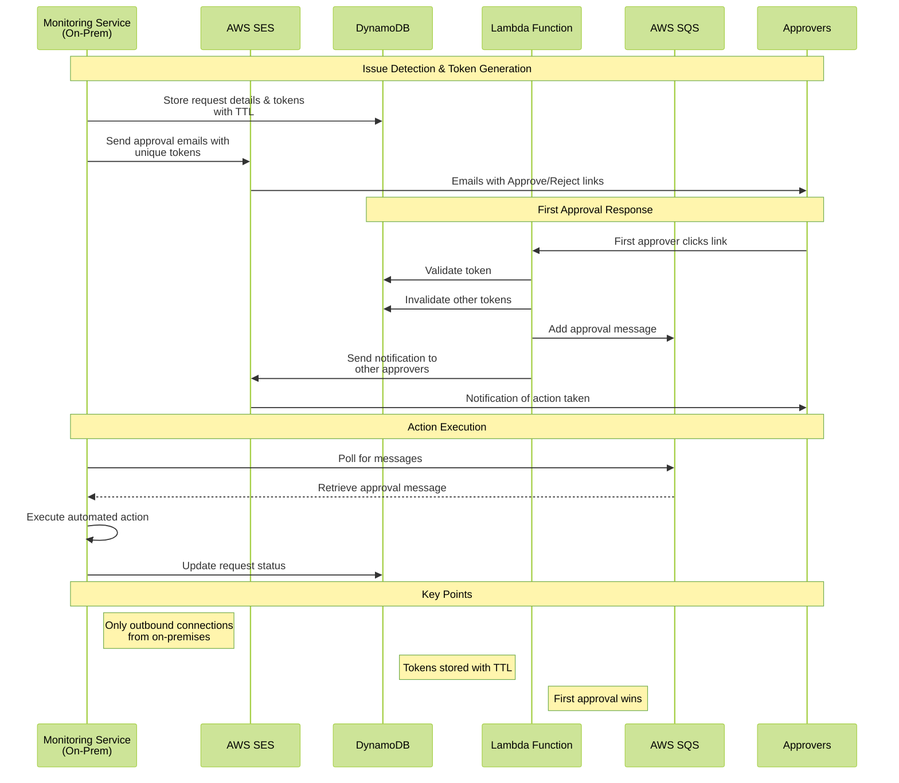

# Issue Action Approval Workflow
This project presents a solution that enables secure, one-way human approval workflows between on-premises systems and AWS cloud services. This is to handle use case where on premises monitoring system triggers an event that requires human approval but we cannot intercept enterprise email system of the company. Use case is described at following Medium location:


https://manjit28.medium.com/

## Sequence Diagram
### Broad Requirement

````mermaid
---
config:
  theme: base
---
sequenceDiagram
    participant Monitoring-System
    participant Approver
    participant Queue
    participant Action-Service
    Monitoring-System->>Approver: Send approval emails with links
    Approver->>Monitoring-System: Click approve/reject link
    Monitoring-System->>Monitoring-System: Invalidate other links
    Monitoring-System->>Queue: Store decision
    Queue->>Service: Process message
    Action-Service->>Monitoring-System: Take action
````

### Refined Requirements with Selected Components




## Cloud Formation Template
Sample cloud formation template to create required resources is attached for reference. If needed, it can be converted to CDK template.

```
cdk migrate --stack-name issue-approval --language python|typescript --from-path \path\sample-cloud-formation-template.json
```
## Code Componenets
There are three Components in attached code:

### Trigerr.Api 
On-premises service. This is what starts the workflow by adding records in DynamoDB tables. Can be expanded as needed.

### ActionProcessor 
On-premises service. This service will actually execute approved action in approval workflow by consuming SQS messages. This code is here just as a placeholder as this will be very custom code based on requested action

### Lambda Function
Runs in cloud. This is where most of the code belongs and this is explained in bit detail below.

## Issue Action Approval Lambda Function

This AWS Lambda function handles the approval workflow for issue actions, managing token validation, status updates, and notifications.

## Overview

The function processes approval requests by:
- Validating approval tokens
- Updating issue and token statuses in DynamoDB
- Revoking other active tokens
- Sending notifications via SQS and email (AWS SES)

## Prerequisites

- .NET 6.0 or later
- AWS Account with appropriate permissions
- AWS CLI configured locally for deployment
- The following AWS services configured:
  - DynamoDB tables (IssueActionApproval and IssueActionToken)
  - SQS Queue
  - SES (for email notifications)

## Required AWS Resources

### DynamoDB Tables

#### 1. IssueActionApproval Table:

Table Name: IssueActionApproval

##### Primary Key: 

RequestId (String)

##### Attributes:

Status (String)

ActionParameters (Map)

#### 2. IssueActionToken Table:

Table Name: IssueActionToken

##### Primary Key:

RequestId (String)

Token (String) 

##### Attributes:

Status (String)

TokenStatus (String)

ExpirationTime (String)

ApproverEmail (String)

### SQS Queue
- FIFO Queue for maintaining message order
- Message retention: 14 days (configurable)

### SES Configuration
- Verified sender email address
- Appropriate sending limits for your use case

## Environment Variables for Lambda Function
ISSUE_TABLE_NAME=IssueActionApproval

TOKEN_TABLE_NAME=IssueActionToken

ISSUE_ACTION_SQS_QUEUE_URL=<your-sqs-queue-url>

SENDER_EMAIL=<your-verified-ses-email>


## Required IAM Permissions

The Lambda function requires the following permissions:

```json
{
    "Version": "2012-10-17",
    "Statement": [
        {
            "Effect": "Allow",
            "Action": [
                "dynamodb:GetItem",
                "dynamodb:UpdateItem",
                "dynamodb:Query"
            ],
            "Resource": [
                "arn:aws:dynamodb:*:*:table/IssueActionApproval",
                "arn:aws:dynamodb:*:*:table/IssueActionToken"
            ]
        },
        {
            "Effect": "Allow",
            "Action": [
                "sqs:SendMessage"
            ],
            "Resource": "arn:aws:sqs:*:*:IssueActionQueue.fifo"
        },
        {
            "Effect": "Allow",
            "Action": [
                "ses:SendEmail",
                "ses:SendRawEmail"
            ],
            "Resource": "*"
        }
    ]
}
```

### NuGet Dependencies
```
<PackageReference Include="Amazon.Lambda.Core" Version="2.1.0" />
<PackageReference Include="Amazon.Lambda.APIGatewayEvents" Version="2.6.0" />
<PackageReference Include="AWSSDK.DynamoDBv2" Version="3.7.x" />
<PackageReference Include="AWSSDK.SQS" Version="3.7.x" />
<PackageReference Include="AWSSDK.SimpleEmail" Version="3.7.x" />
```
### API Gateway Integration
#### Request Parameters

action: String (Required)

requestId: String (Required)

token: String (Required)

#### Response

Response Codes

200: Success

400: Invalid request or token

500: Internal server error
